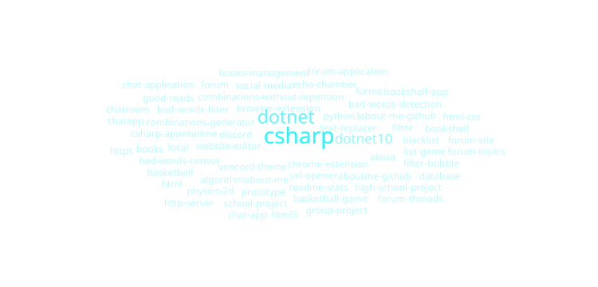

# Hello World👋
Im Noah🙌\
Hit me up or connect with me here⬇️

# A bit about me🚀
🇩🇰 A certified idiot based in Denmark\
📖 By day: Grinding through [HTX (Kommunikation & IT + Programmering)](https://www.hansenberg.dk/htx/kommunikation-og-it-a-og-programmering-b/)\
🍔 By night: Keeping the fries crispy and the crew in line as Shift Leader at Carl's Jr.\
💻 Somewhere in between: Teaching myself to actually make computers do what I want\
🎯 Currently on a mission to turn "words on a page" into "a page with words about me"

### Fun facts🍟
- 🕐 I've perfected the art of coding between shifts
- 🤔 I'm probably A/B testing a headline in my head right now
- 📈 I'm also looking at new stocks to add to my portfolio while writing
- 🙃 Even though it may not be so obvious here, I really like emojis and believe every message should have one :)

# Topics about stuff i've worked on😅

